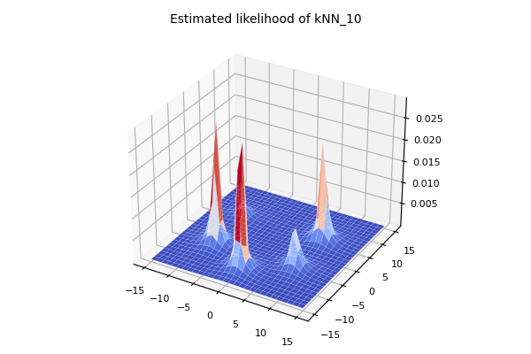
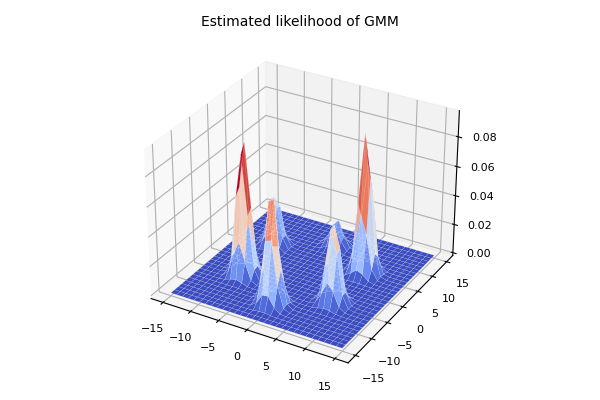
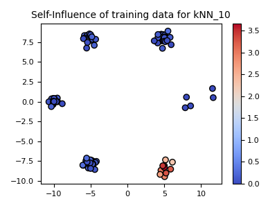
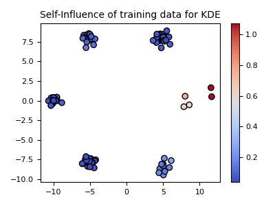
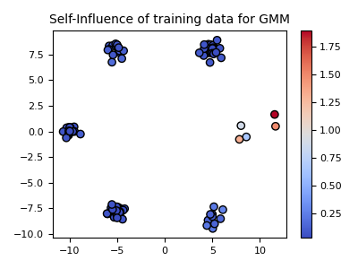

# Influence Function (IF) for classical generative models

A brief notebook on Influence Function (IF) for classical generative models (e.g., $k$-NN, KDE, GMM)

# Training data

# Results

| metric | $10$-NN | KDE | GMM |
|:---:|:---:|:---:|:---:|
| LL |  |  |  | 
| Self-IF |  |  |  | 
| IF over (5,8) |  |  |  | 
